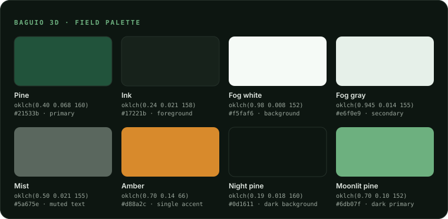

<p align="center">
  
</p>

<h1 align="center">Baguio 3D</h1>

<p align="center"><em>The Summer Capital, in three dimensions.</em></p>

An interactive 3D map and field guide to Baguio City — the Summer Capital of the Philippines. Fly over pine-forest terrain rendered from real elevation data, trace jeepney routes from the City Plaza terminal, walk four eras of hill-station history on a timeline, and browse where to eat and stay, all pinned to one 3D map.

## Overview

Baguio sits a mile up in the Cordilleras, and flat maps don't do it justice. This project renders the city's actual terrain in the browser (MapLibre GL over AWS Terrarium elevation tiles), then layers the city's story on top: 22 destinations with elevations and coordinates, 6 jeepney lines with a fare calculator, a four-era history timeline from Ibaloi Kafagway to today's Creative City, and 30 restaurants, cafés, and lodges with hours and price ranges.

Geospatial data lives in PostgreSQL/PostGIS and is served through Next.js route handlers with Redis caching; the content pages are statically rendered from curated GeoJSON. No map API keys or paid accounts are required — tiles come from OpenFreeMap and terrain from the AWS Open Data Terrarium set.

## Features

- **3D terrain map** — real elevation, tilt and rotation controls, camera presets for Burnham Park, Session Road, Mines View, Camp John Hay, and Kennon Road, plus a satellite imagery toggle
- **Destinations layer** — viewport-driven markers with clustering, category and era filters, and a detail sheet with elevation readouts and deep links (`/map?dest=...`)
- **Jeepney transit** — 6 routes with stops drawn on the map, route highlighting, and a fare calculator using the ₱13 first-4-km flag-down rules (taxi estimates included)
- **History timeline** — four eras (Ibaloi pasture → American hill station → wartime → Creative City) with a scrubber that flies the camera to each event's location
- **Eat & stay directory** — carinderias to heritage hotels, with open-now badges, price-range glyphs, amenities, and map pins
- **Field-notes design system** — Fraunces display type, Geist Mono "survey readout" labels, an oklch pine-and-fog palette, and custom contour/treeline/fog atmosphere art
- **Finished-state UX** — skeleton loaders that mirror layout, composed empty and error states, keyboard navigation with visible focus rings, Escape-to-close panels, reduced-motion-aware camera and animations, skip-to-content link
- **Shareable** — branded Open Graph card, SVG favicon and apple icon generated from the pine mark

## Tech stack

| Layer | Technology |
|---|---|
| Framework | [Next.js 16](https://nextjs.org) (App Router) · React 19 · TypeScript 5 |
| Map engine | [MapLibre GL JS 5](https://maplibre.org) · [OpenFreeMap](https://openfreemap.org) vector tiles · AWS Terrarium terrain DEM |
| Styling | Tailwind CSS v4 · shadcn/ui on Base UI · tw-animate-css |
| Database | PostgreSQL + [PostGIS](https://postgis.net) — local via Docker (16/3.4) or hosted on [Supabase](https://supabase.com) (17/3.3) · Prisma 7 (`@prisma/adapter-pg`, raw SQL for spatial queries) |
| Cache | Redis 7 via ioredis |
| Geospatial | Turf.js · curated GeoJSON in `data/geojson` |
| State | zustand |
| Fonts | Fraunces · Inter · Geist Mono (via `next/font`) |

## Brand

The identity reads like field notes from a hill station: Fraunces for display headlines, Inter for body text, and Geist Mono for the uppercase "survey readout" voice used on coordinates, elevations, fares, and years.

### Color palette



Pine green carries the brand; fog-tinted cool neutrals ground it; a single amber is the sparing accent. All colors are defined as oklch tokens in [`app/globals.css`](app/globals.css) — components consume semantic tokens (`primary`, `secondary`, `accent`, …), so the theme can be retuned in one place.

| Token | Role | OKLCH | Hex |
|---|---|---|---|
| Pine | `--primary` (light) | `oklch(0.40 0.068 160)` | `#21533b` |
| Ink | `--foreground` | `oklch(0.24 0.021 158)` | `#17221b` |
| Fog white | `--background` | `oklch(0.98 0.008 152)` | `#f5faf6` |
| Fog gray | `--secondary` | `oklch(0.945 0.014 155)` | `#e6f0e9` |
| Mist | `--muted-foreground` | `oklch(0.50 0.021 155)` | `#5a675e` |
| Amber | `--amber` accent | `oklch(0.70 0.14 66)` | `#d88a2c` |
| Night pine | `--background` (dark) | `oklch(0.19 0.018 160)` | `#0d1611` |
| Moonlit pine | `--primary` (dark) | `oklch(0.70 0.10 152)` | `#6db07f` |

### Brand icon

The pine mark is the single logo element, drawn once in [`components/site/PineMark.tsx`](components/site/PineMark.tsx) and reused everywhere it appears:

- [`app/icon.svg`](app/icon.svg) — favicon: the mark in fog white on a pine rounded square
- [`app/apple-icon.tsx`](app/apple-icon.tsx) — 180×180 home-screen icon, generated at build time
- [`app/opengraph-image.tsx`](app/opengraph-image.tsx) — 1200×630 share card: the mark in amber over night pine with contour-line texture

## Local setup

**Prerequisites:** Node.js 20+, Docker Desktop (for PostGIS and Redis), npm.

```bash
# 1. Clone and install
git clone https://github.com/<your-username>/baguio-city-3d.git
cd baguio-city-3d
npm install

# 2. Environment — defaults match docker-compose.yml, no API keys needed
cp .env.example .env

# 3. Start PostGIS + Redis
docker compose up -d

# 4. Create the schema and seed destinations, routes, venues, and history
npx prisma migrate dev
npx prisma db seed

# 5. Run the dev server
npm run dev
```

Open [http://localhost:3000](http://localhost:3000) — the 3D map lives at [/map](http://localhost:3000/map).

> **Note:** the content pages render without the database, but the map's data layers (`/api/geo/*`, `/api/venues`) return 500s if Docker isn't running. If markers or routes fail to load, check `docker compose ps` first.

### Using Supabase instead of local Postgres

The schema is also deployed to a hosted Supabase project (PostGIS 3.3 on Postgres 17), managed with the Supabase CLI. Migrations live in [`supabase/migrations`](supabase/migrations) and mirror the Prisma migration exactly.

```bash
# 1. Authenticate and link the CLI to the project
supabase login
supabase link --project-ref tnqeqtcjtridhjbcdlbe

# 2. Apply schema + seed data. Both authenticate with the CLI access token —
#    no database password needed.
supabase db push --include-seed

# 3. Create the app's read-only login role (writes supabase/roles.sql, gitignored)
supabase db push --include-roles

# 4. Point the app at Supabase — see .env.example for the URL shapes.
#    DATABASE_URL = pooled (6543) for runtime; DIRECT_URL = direct (5432) for
#    migrations.
```

The app connects as `baguio_app`, a least-privilege role with `SELECT` and a read policy per table — not as `postgres`. The role and its password are created by `supabase/roles.sql`, which is gitignored because it contains a secret; regenerate it rather than sharing it. Using a non-owner role means RLS genuinely applies to the app, which is why the read policies in the third migration exist.

`supabase/seed.sql` is generated from `data/geojson` by `npm run seed:supabase:generate` — regenerate it rather than editing it by hand. It exists alongside `prisma/seed.ts` because the two need different credentials: the Prisma seeder requires `DATABASE_URL` (the database password), while the CLI seeder needs only the access token. If you do have `DATABASE_URL` set, `npx prisma migrate resolve --applied 20260711000000_init && npx prisma db seed` is equivalent.

`supabase db push` applies any new local migration to the hosted project; `supabase migration new <name>` starts one.

Two things worth knowing about this setup:

- **PostGIS is installed in `public`**, not Supabase's `extensions` schema, so the unqualified `geometry(...)` columns and `ST_*` calls behave identically on Supabase and on local Docker. The trade-off is that Supabase's database linter reports `extension_in_public`, plus findings on PostGIS's own `spatial_ref_sys` table and `st_estimatedextent` function. Those objects are owned by `supabase_admin` and cannot be revoked by the project's `postgres` role. They expose only public EPSG reference data, not application data.
- **Row Level Security is enabled on all nine app tables with no policies.** The app reaches Postgres directly through Prisma, which bypasses RLS, so this costs nothing at runtime while closing the auto-generated PostgREST API — verified: the `anon` role reads zero rows from tables that `postgres` reads normally.
- **Redis is not part of Supabase.** Keep the `redis` service from docker-compose, or point `REDIS_URL` at any managed Redis.

### Useful commands

```bash
npm run build      # production build
npm run lint       # eslint
npx prisma studio  # inspect the database
```

## Data notes

Destination, route, venue, and history content is curated for this project from public sources; fares reflect the LTFRB flag-down rates at the time of writing. Terrain © Mapzen/Tilezen via AWS Open Data; basemap © OpenMapTiles/OpenStreetMap contributors.
