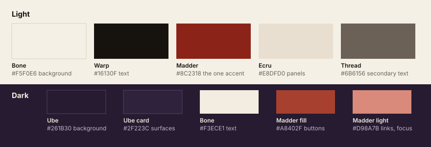

<p align="center">
  
</p>

<h1 align="center">Baguio 3D</h1>

<p align="center"><em>Baguio City, mapped in 3D.</em></p>

An interactive 3D map and field guide to Baguio City, the Summer Capital of the Philippines. Fly over the city's real terrain, board the right jeepney, check what's open, and read the city's past, all on one map.

## Overview

Baguio sits about 1,500 m up in the Cordillera, and a flat map hides the hills. This site renders the real terrain in the browser (MapLibre GL over AWS Terrarium elevation tiles) and layers the city on top:

- 22 destinations with DEM-checked elevations
- 6 jeepney routes that follow the roads, with their stops and a fare estimate
- 30 places to eat and stay, with hours where they're posted
- a four-era history timeline with 17 events pinned to the map

Geodata lives in PostgreSQL + PostGIS (hosted on Supabase) and is served through Next.js route handlers with Redis caching. Content pages are statically rendered. No map API keys are needed: the basemap comes from OpenFreeMap and the terrain from AWS Open Data.

## Features

- **Homepage.** A hero with a live-map still, a proof strip of what the map is made of, and a three.js wireframe of the terrain. A carousel steers a live 3D map to each place. It ends with a native `<details>` FAQ and a closing call to action over parallax ridgelines.
- **3D map (`/map`).** Real elevation with 1.35× exaggeration, tilt and rotation, camera presets and a satellite toggle. The OpenFreeMap basemap is re-dyed into the site's palette, with hillshade relief. Destination markers, route highlighting and deep links (`/map?dest=…`, `/map?route=…`) are included.
- **Jeepneys (`/transit`).** Six routes from the City Plaza. The lines were snapped to real roads with OSRM from a hand sketch (`scripts/snap-routes.mjs`). Stops the sketch put off the road were moved onto it, and tests guard that no line doubles back. One exception remains: the Km 4 stop on the La Trinidad line awaits a local check. Each fare shows where it came from:
  - The modern PUJ fare follows the LTFRB guide effective 2026-03-19.
  - Traditional and taxi fares are marked "not yet checked".
  - Distance is straight-line.
- **Eat and stay, destinations, history.** Open-now badges in Baguio time, price glyphs, a scrubbable history timeline that flies the camera to each event, and per-destination pages with "Getting here" links.
- **Corrections (`/corrections`).** Visitors report wrong data through a form stored in Supabase. The optional reply email is cleared by a daily `pg_cron` job once the report is resolved, or after 90 days.
- **Light and dark.** The dark theme is ube, not black. The toggle recolours the whole site live: chrome, basemap, sky and wireframe. The choice follows the system until changed.
- **Privacy.** Google Analytics 4 loads only after an explicit consent choice, which can be changed at any time. The privacy and terms pages (`/privacy`, `/terms`) and `/about` list every data source.
- **SEO and sharing.** Canonical URLs, a sitemap and robots.txt, JSON-LD structured data, and generated Open Graph and apple icons.
- **Accessibility.** Visible focus rings, a skip link, labelled carousel controls, reduced-motion paths for every animation and camera move, and no layout overflow at 360 px.

## Tech stack

| Layer | Technology |
|---|---|
| Framework | [Next.js 16](https://nextjs.org) (App Router), React 19, TypeScript 5 |
| Map | [MapLibre GL JS 5](https://maplibre.org), [OpenFreeMap](https://openfreemap.org) vector tiles, AWS Terrarium terrain |
| 3D | three.js (homepage terrain wireframe) |
| UI | Tailwind CSS 4, MUI 9 (themed flat and square), Swiper, lucide-react |
| Database | PostgreSQL + [PostGIS](https://postgis.net) on [Supabase](https://supabase.com), or local via Docker; Prisma 7 with raw SQL for spatial queries |
| Cache | Redis 7 via ioredis |
| Geospatial | Turf.js, curated GeoJSON in `data/geojson` |
| Analytics | GA4 via `@next/third-parties`, consent-gated |
| Tests | Vitest (unit), Playwright (desktop + Pixel 7) |
| Hosting | Vercel |

## Design: Cordillera Weave

The identity borrows from Cordillera backstrap weaving: an undyed bone ground, warp-thread text, and madder red as the only accent. There is no green anywhere, parks included. Surfaces are flat, corners are square (0.125 rem), and woven edges replace shadows. One type family, Archivo, uses its width axis to do the work of a display face. Geist Mono is used only for numeric readouts such as elevations.



Tokens live in [`app/globals.css`](app/globals.css), with the dark theme under `[data-theme="dark"]`. MUI reads the same values from [`app/theme.ts`](app/theme.ts), and [`components/map/basemapTheme.ts`](components/map/basemapTheme.ts) holds the map's day and night palettes. Copy rules: sentence case; no em dashes, no " · " separators, no arrows in link text.

## Local setup

**Prerequisites:** Node.js 20+, npm, and Docker Desktop (only for the local database option).

```bash
git clone https://github.com/NightServant/baguio-city-3d.git
cd baguio-city-3d
npm install              # run again after pulling changes to package.json
cp .env.example .env     # defaults match docker-compose.yml

docker compose up -d     # PostGIS + Redis
npx prisma migrate dev
npx prisma db seed

npm run dev              # http://localhost:3000, map at /map
```

The content pages render without the database. The map's data layers (`/api/geo/*`, `/api/venues`) need it, so if markers or routes don't load, check `docker compose ps` first.

### Environment

| Variable | Purpose |
|---|---|
| `DATABASE_URL` / `DIRECT_URL` | Pooled runtime and direct migration connections (see `.env.example`) |
| `REDIS_URL` | Cache; the app degrades gracefully if it's unreachable |
| `NEXT_PUBLIC_SITE_URL` | Canonical origin; on Vercel, leave unset to use the production URL |
| `NEXT_PUBLIC_CONTACT_EMAIL` | Shown in the footer and privacy policy; hidden while unset |
| `NEXT_PUBLIC_GA_ID` | GA4 measurement ID; analytics stays off while unset |

### Supabase

The hosted project runs Postgres 17 with PostGIS 3.3. Migrations live in [`supabase/migrations`](supabase/migrations).

```bash
supabase login
supabase link --project-ref tnqeqtcjtridhjbcdlbe
supabase db push --include-seed    # schema + data
supabase db push --include-roles   # app login role (writes supabase/roles.sql)
```

- **Least privilege.** The app connects as `baguio_app`, with read grants and RLS read policies per table and insert access to `corrections`. It never connects as `postgres`. `supabase/roles.sql` holds that role's password, so it is gitignored; regenerate it rather than sharing it.
- **No Data API.** RLS is on for every table, the PostgREST roles are revoked, and the project's Data API is off.
- **Seed file.** `supabase/seed.sql` is generated from `data/geojson` by `npm run seed:supabase:generate`. Don't edit it by hand.
- **Data fixes.** Corrections to existing data ship as migrations, for example corrected elevations, road-snapped routes and Burnham's 1905 plan date. After one changes route geometry, flush the Redis `geo/transit/routes*` keys.
- **PostGIS lives in `public`,** so the same SQL runs on Supabase and on local Docker. Supabase's linter flags `extension_in_public` for this. The objects it flags are owned by `supabase_admin` and expose only EPSG reference data.
- **Redis is separate.** It isn't part of Supabase; use the docker-compose service or any managed Redis.

### Commands

```bash
npm run build       # production build
npm run lint        # eslint
npm test            # Vitest unit tests
npm run test:e2e    # Playwright: builds and serves on port 3100
npx prisma studio   # inspect the database
```

### Data scripts

- `scripts/snap-routes.mjs` snaps `data/geojson/jeepney-routes.sketch.geojson` to the road network with the public OSRM demo, at most 1 request per second. It writes `jeepney-routes.geojson` and logs every stop it moves.
- `scripts/generate-supabase-seed.mjs` regenerates `supabase/seed.sql` from the GeoJSON, with deterministic UUID v5 ids.
- `scripts/capture-map-posters.mjs` captures the homepage map stills.
- `scripts/baguio-dem-probe.py` and `scripts/fix-elevations.py` sample the Terrarium DEM. They produced the corrected destination elevations.

## Data notes

Content is curated from public sources, and every one is listed on `/about`. Fares state their source and date; unverified fares say so. Jeepney lines follow the roads between stops, but the jeepney's exact path can differ. Terrain: Mapzen / Tilezen via AWS Open Data. Basemap: OpenFreeMap, © OpenStreetMap contributors.

## Roadmap

A Blender-authored 3D model of Baguio is planned. It covers photoreal landmark meshes rendered through a MapLibre custom layer, georeferenced on the live terrain; see [`docs/baguio-3d-model-plan.md`](docs/baguio-3d-model-plan.md).
